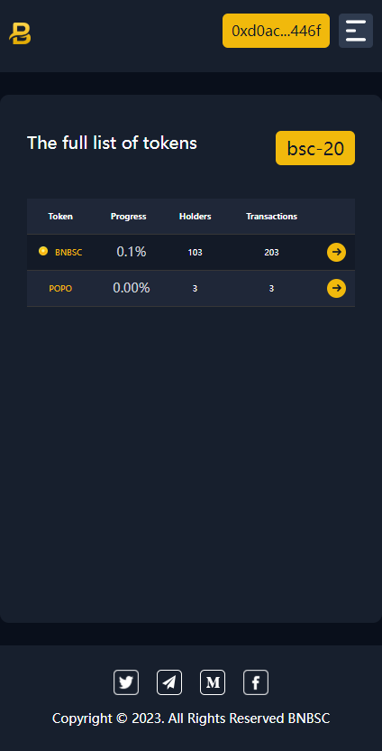

## BNB铭文平台
A comprehensive inscription indexing market based on the BNB network. It encompasses deployment, indexing, inscribing, and trading functionalities, dedicated to fostering the development of the BNB ecosystem and exploring more ecological applications on the BNB chain. 基于BNB网络的铭文索引市场。它包含部署、索引、录入、交易等功能，致力于促进BNB生态系统的发展，探索更多BNB链上的生态应用。
## 项目链接
www.xxx.com
## 奖励
BNBSC将推出其平台生态代币(简称“平台代币”)，旨在促进平台生态系统的建设和发展，特别是通过奖励为平台做出贡献的用户。在接下来的运营中，用户在平台上进行部署、铸造等活动，将获得平台代币作为奖励。这些奖励可以通过平台直接申领，激励用户积极参与生态系统的发展。
## 功能说明

### 1.初始铭文 Deploy
总量：21000000
`
{"p":"bsc-20","op":"deploy","tick":"bnbsc","amt":"10"}
`
### 2.铸造 Mint
每个账号最多铸造10个铭文，（铸造费用：一个铭文 xxx BNB）
`
//Mint
data:application/json,
{
    "p":"bsc-20",
    "op":"mint",
    "tick":"tick name"
}
`
### 3.转账 Transfer
单个铭文转账 （转账费用：一个铭文 xxx BNB）
### 4.兑换 Exchange
铭文兑换token
1.初始铭文
### 5.质押 Staking
单铭文质押。（每天收益多少个token）
领取质押奖励 （奖励token）
### 6.市场 Marketplace
市场交易 （只有2级及以上的铭文可以交易）
#### 6.1 上架 （上架手续费 token）
#### 6.2 购买 （购买 支付token）
#### 6.3 领取质押奖励 （奖励token）

#### 7.合成铭文 （合成手续费 token * 铭文等级）
合成有几率失败。（百分比）
2个1级铭文合成2铭文，2级合成3级铭文.....
质押铭文越高级获得质押奖励token越多

### 8.铭文回收（5级及以上铭文回收 （回收价格 xxx BNB））

### 9.市场和合成铭文等收取的token及时销毁

## 相关截图
### 1.PC端浏览器
bsc-20铭文

我的铭文

持有者

市场（待开发）
### 2.手机浏览器

## 开发各种DAPP，区块链项目，联系方式:
Telegram: https://t.me/OS_Blockchain